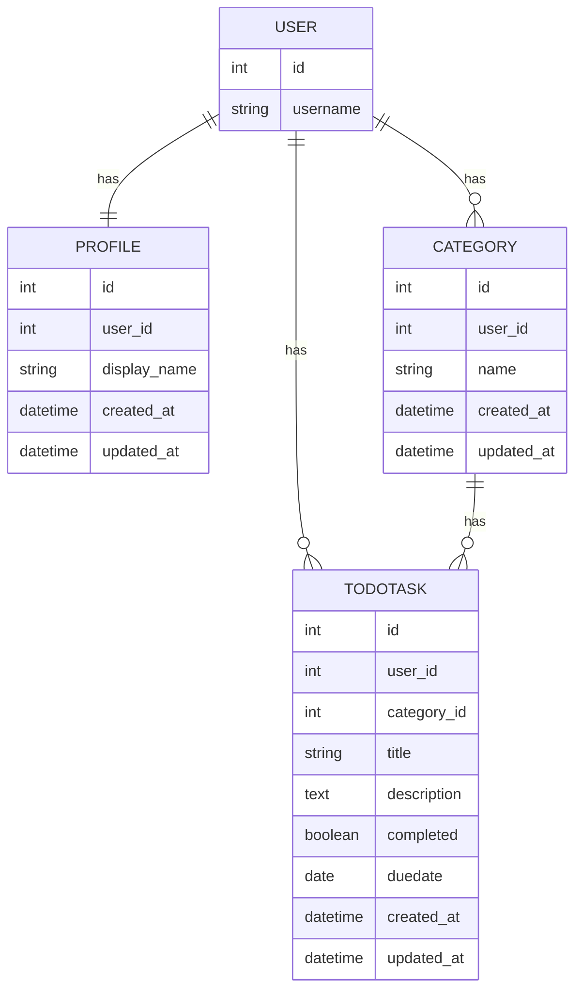

# Django Todo App
タスク管理アプリ（ログイン / 登録 / タスクCRUD / カテゴリ / ステータス）のプロジェクトです。

---

## 前提
以下のツールが必要です:
* Docker / Docker Compose
* （Docker を使わない場合）
  * Python 3.11 以上
  * MySQL 8系

---

## 構成

* `Dockerfile`: Python + Django 実行環境
* `docker-compose.yml`: Django + MySQL の構成
* `djangopj/settings.py`: DB 接続設定（MySQL）
* `todo/`: アプリ本体

## Model図
※ USERはDjangoデフォルトモデルを使用


---

## 起動方法（Docker使用時）

### 1. リポジトリをクローン

```bash
git clone https://github.com/raretech-hal/django-todoapp.git
cd django-todoapp
```

### 2. コンテナ起動

```bash
docker compose up -d --build
```

### 3. マイグレーション

```bash
docker compose exec web python manage.py migrate
```

### 4. 管理ユーザー作成（任意）

```bash
docker compose exec web python manage.py createsuperuser
```

### 5. ブラウザでアクセス

```
http://localhost:8000
```

---

####  補足（重要）

* `web` コンテナは起動時に以下を自動実行します

```bash
python manage.py runserver 0.0.0.0:8000
```

そのため **手動で runserver を実行する必要はありません**

---

#### 初回起動時の注意

MySQL の起動が間に合わず、エラーになる場合があります。

その場合は以下コマンドを実行してください

```bash
docker compose restart web
```

---
<br>
<br>

## ※ Docker を使わない場合

### 1. 仮想環境

```bash
python3 -m venv .venv
source .venv/bin/activate
```

### 2. 依存関係

```bash
pip install -r requirements.txt
```

### 3. MySQL 設定

`settings.py` を以下に合わせる：

* DB名: `django-db`
* ユーザー: `django`
* パスワード: `django`
* HOST: `localhost`

### 4. マイグレーション

```bash
python manage.py migrate
```

### 5. サーバ起動

```bash
python manage.py runserver
```
